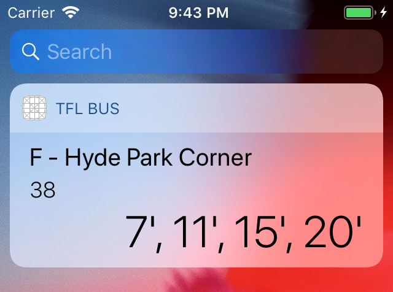

# TfL Bus Widget

iOS widget to display specific _Transport for London_ bus stop/line arrival times.

APIs: [TfL Wrapper](https://gitlab.com/horothesun/TfLWrapper) (docs: [YAML](https://tfl-wrapper.herokuapp.com/docs.yaml), [JSON](https://tfl-wrapper.herokuapp.com/docs.json)).

## Modules

